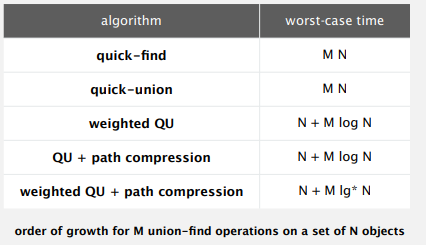

# **My process**

## Table of Contents

- [Lec1: Introduction to Java (done)](#lec1-introduction-to-java-done)
- [Lec2: Union-Find (done)](#lec2-union-find-done)
- [Lec3: Algorithm Analyzing (done)](#lec3-algorithm-analyzing-done)
- [Lec4: Stack and Queue (done)](#lec4-stack-and-queue-done)
- [Lec5: Simple Sorting Algorithms (done)](#lec5-simple-sorting-algorithms-done)
- [Lec6: Merge Sort and Quick Sort (done)](#lec6-merge-sort-and-quick-sort-done)
- [Lec7: Priority Queue (done)](#lec7-priority-queue-done)
- [Lec8: Midterm Exam Preparation (done)](#lec8-midterm-exam-preparation-done)
- [Lec9: Symbol Table and Binary Tree (done)](#lec9-symbol-table-and-binary-tree-done)
- [Lec10: Binary Search Tree, Balanced Search Tree (done)](#lec10-binary-search-tree-balanced-search-tree-done)
- [Lec11: Hash Table (done)](#lec11-hash-table-done)
- [Lec12: Graph (done)](#lec12-graph-done)
- [Lec13: Minimum Spanning Tree (done)](#lec13-minimum-spanning-tree-done)
- [Lec14: Shortest Path (done)](#lec14-shortest-path-done)
- [Lec15: Dynamic Programming, NP-Completeness (done)](#lec15-dynamic-programming-np-completeness-done)

***Continue reading notes here:*** [Final Exam review](note/Final%20Exam%20DSA/)

## Lec1: Introduction to Java (done)
  + IntroJava
## Lec2: Union-Find (done)
  + Percolation
  + Quick find (optimize find is O(1)) is too slow (with access model is N^2 to 
process a sequence of N union operations of N object). Union too expensive. Trees are flat,
but too expensive to keep them flat
  + Quick union: Trees can get tall. Find/connected too expensive (could be N array accesses).
  + Improvement 1: Weighting: Keep track of size of each tree to avoid tall tree by linking
root of smaller tree to root of larger tree.
    + Find: take time proportional to depth of p
    + Union: takes constant time, **given roots**
    + Depth of any node x is at most lg(N) (Pf: What cause depth of tree contain x increase? 
    The size of tree can double at most lgN time means at most lgN of depth. Why?).
    + Hence, we can ensure find O(lgN), union O(lgN), connected O(lgN)
  + Improvement 2: path compression: Make every node in path point to its grandparent
    + Keep tree almost completely flat
  + wighted QU + path compression: in theory is not linear but linear in practice.
  + Benefits: It significantly improves the performance of the union-find algorithm in practical scenarios.

  
## Lec3: Algorithm analyzing (done)
  + Linkedlist: Hackerrank
  + Interface and Generic: Build my Linkedlist
  + Observation
    + Empirical analysis
    + Data analysis (Standard plot, Log-log plot)
    + Example for Log-log plot
    
    
    
  + Mathematical model
    + Simplification 1: Cost model
    + Simplification 2: Tilde notation
    + Diversion: estimate a discrete sum (Trick: replace sum with an integral, and use calculus.)
  + Order-of-growth classification(Better => Faster in practice)
    
    

  + Theory of algorithm
    + Best case: Lower bound on cost (a goal for all input)
    + Worst case: Upper bound on cost (a guarantee for all input)
    + Average case: Expected cost for random input (a way to predict performance)
    + Optimal algorithm: Lower bound = upper bound (to within a constant factor)
    + Notation:
  
    
  
  + Memory: Typical memory in Java
    + Object overhead: 16 bytes
    + Reference: 8 bytes
    + Padding: Each object uses a multiple of 8 bytes
  
## Lec4: Stack and Queue (done)
  + Iterator: Build my Stack and Queue
  + Stack LIFO and Queue FILO: Hackkerank
  + When i mention linked list, i mean singly linked list. In doubly linked list, it's easier to implement.

  + Stack: linked list
    + push: O(1)
    + pop: O(1)
  + Stack: resizing array (Remember: amortized analysis account for the long-term 
  average performance rather than worst-case for each operation)
    + Double when array is full
    + Halve size when array is one-quarter full
    + Array is between 25% and 100% full
    + We have N for doubling and halving operations

  

  + Queue: linked list
    + enqueue: O(1) (we save position last node of list)
    + dequeue: O(1) 
  + Queue: resizing array:
    + We keep elements in queue in middle of arrays, not at start either end.
    + Enqueue and dequeue have same complexity as stack
  + Generic: use parameter to specify type
  + Iterator: use a same interface for loop through any type of object which is implementation of Iterator

  + Solution for Dequeues and Randomized Queues on Coursera
## Lec5: Simple Sorting algorithms (done)
  + Insertion sort and Selection sort: Report in [this file](src/Lec5/Report.md)
  + Shuffle algorithm
  + Exercise on HackerRank
  + Selection sort: find the smallest element in remaining entry => swap
    + Invariant: left in ascending order, no entry to right smaller than any entry to the left
    + Performance: insensitive with input, always O(N^2)
  + Insertion sort: swap current with each larger entry to its left
    + Best case: O(N) - ascending order
    + Worst cast: O(N^2) - descending order
    + For partially-sorted array: we knew number of swap equal to number of inversion which is <= c*N in this case.
    Hence, running time of insertion sorted with partially-sorted array is linear time O(N). (REMEMBER)
    + Improvement:
      + Half exchange: Shift items over(instead of exchanging)
      + Binary insertion sort
  + Bubble sort: swap max element to last of array (bubble swim up)
    + Best case: O(N), break loop with boolean swapped know whether array is sorted or not
    + Worst case: O(N^2)
    
  

  + Shuffling: Knuth shuffle
    + Ensure probability of each result tuple is equal
## Lec6: Merge sort and Quick sort (done)
  + Sort2: Ex1, Ex2
  + Mergesort and Quicksort Implementation
  + Update report in [this file](src/Lec5/Report.md)
  + Merge sort:
    + Basic plan: Divide array into two halves => Recursively sort each half => Merge two half
    + Number of compares <= NlgN
      + Proof by picture
      + Proof by induction
    + Number of array access <= 6NlgN
    + In-place: use <= cLogN extra memory => not in-place with merge sort
    + Practical improvements
      + Use insertion sort for small sub arrays
      + Stop if already sorted
      + Eliminate the copy to the auxiliary array (save time not space)
    + Bottom-up merge sort:
      + Pass through array, merging subarray of size 1
      + Repeat for subarray of size 2, 4, 8,...
      + Simple and non-recursive but slower than top-down (when use on system)
    + Sorting complexity:
      + Model of computation: decision tree (each leaf corresponding to one ordering). We have N! ordering of give array
      + Cost model: compare (access, ...)
      + Upper bound: NlgN for mergesort
      + Lower bound: N! different ordering in decision tree means at least N! leaf => at least lg(N!) ~ Nlog(N) 
      + With cost model is compare: merge sort is optimal (upper and lower meet)
      + Merge sort is not optimal with memory usage.
      + Lower bound can take advantage of initial order, distribution of key values, representation of keys.
    + Comparator
      + Comparator interface implementation
    + Stability: preserve the relative order of items with equal keys
    
    
  
    + Make use of cache than heap sort, with segment is larger than heapsort, data from heapsort is scattering
## Lec7: Priority queue (done)
  + Priority Queue Implementation
  + Sort2: all rest exercise in Sort2 
## Lec8: Midterm exam: Prepare for test (Works on Leetcode) (done)
  + Union - Find
  + Algorithm analysis
  + Queue and Stack
  + Simple sorting algorithm
  + Merge sort
  + Solution for 8-puzzle on Coursera
## Lec9: Symbol table and BinaryTree (done)

## Lec10: BinarySearchTree, BalancedSearchTree (done)

## Lec11: Hash Table (done)

## Lec12: Graph (done)

## Lec13: Minium spanning tree (done)

## Lec14: Shortest Path (done)

## Lec15: Dynamic Programming, NP-Completeness (done)

***Continue read note here:*** [Final Exam review](note/Final%20Exam%20DSA/)
